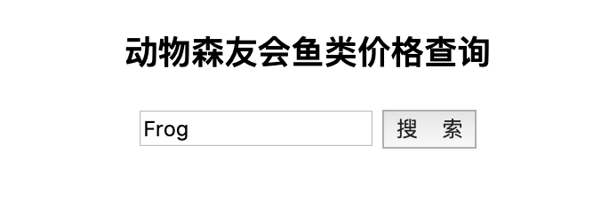
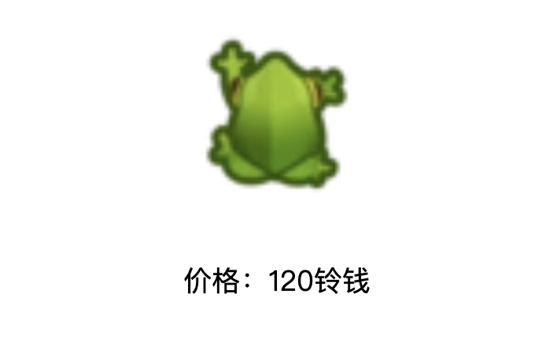

正好最近大家都在为 Hackathon 做准备，这里分享一下用 Flask+Axios 实现前后端数据互通的小例子，仅供入门参考。

# 工具准备

## Flask

```
pip install flask
```


## Axios

> https://cdnjs.cloudflare.com/ajax/libs/axios/0.19.2/axios.min.js


## 数据

下面的例子用动物森友会中鱼类的价格、活动季节、图片等数据作为测试数据，通过关键词进行查询并做前端展示，数据来源：

> https://raw.githubusercontent.com/chendaniely/animal_crossing/master/data/final/without_raw_html/acnh_fish_n.tsv


下面介绍实现前后端分离的过程：前端输入鱼的名称，点击前端“查询”按钮，通过 Axios 把前端输入的字符串传给后端的函数，函数通过鱼的名称进行检索，找出该鱼类的价格及图片链接，数据查询完成后，把结果传给前端进行可视化。


# 后端

首先是后端部分，创建一个 main.py 文件作为我们的后端主文件，首先引入相关包，创建一个 Flask 实例：

```
import pandas as pd
from flask import Flask, jsonify, request
from flask_cors import CORS
import traceback

app = Flask(__name__)
app.config.from_object(__name__)
app.config['SEND_FILE_MAX_AGE_DEFAULT'] = 1

CORS(app, resources={r'/*': {'origins': '*'}})
```

然后写处理数据的函数，将结果以 dict 形式存储：

```
# 数据处理
def get_data_by_keyword(keyword):
  df = pd.read_csv(base_url + 'animal-crossing-fish-info.csv')
  df['price'] = df['price'].astype(str)
  price = df[df['name'] == keyword]['price'].iloc[0]
  image = df[df['name'] == keyword]['image'].iloc[0].split('\t')[0] + '>'
  fish_info = {'price': str(price), 'image': image}
  
  return {'fish_info': fish_info}
```

接下来是接收前端输入数据的部分，这里的 /data_generate 即为前端数据进行 post 的目的路径，通过 request 拿到前端出来的数据后，调用刚才写好的 get_data_by_keyword() 进行数据处理：

```
@app.route('/data_generate', methods=['POST'])
def data_generate():
  global data
  
  if request.method == 'POST':
    
    try:
      post_data = request.get_json()
      keyword = post_data.get('search')
      data = get_data_by_keyword(keyword)
      message = {'status': 'success'}
    
    except Exception as e:
      traceback.print_exc()
      return jsonify({'status': 'fail'})
    
    else:
      return jsonify(message)
```

然后是将上一步处理好的结果数据传回前端，这里的 /get_data 为前端结果页面拿数据的路径：

```
@app.route('/get_data', methods=['GET'])
def get_data():
  global data
  if request.method == 'GET':
    try:
      arg = request.args.get('name')
      response_data = data.get(arg)
      
      return jsonify(response_data)
    
    except Exception as e:
      traceback.print_exc()
      
      return None
```

最后一步就是启动 Flask 服务了（端口可自行设置）：

```
if __name__ == '__main__':
  app.run(port=8000)
```


# 前端

## 前端给后端发送数据

后端完成后，就可以写前端页面了，首先建一个可输入关键词查询的首页 index.html，先写好静态部分，对后面需要操作的组件进行 id 的设置，以便后续调用。这里对 button 组件进行了 onclick 事件的设置，命名 jump()，这样我们在前端点击这个 button 时，就会触发 jump() 事件中的动作：

```
<!DOCTYPE html>
<html lang="en">
<head>
  <meta charset="utf-8">
  <title>动物森友会鱼类价格查询</title>
</head>

<body>
<div class="container" id="app">
  <h3 style="text-align:center">动物森友会鱼类价格查询</h3>

  <div style="text-align:center">
    <input id="search-word" type="text" οnkeydοwn="jump(event);" placeholder="">
    <button class="btn btn-search" id="click-search" type="button" value="start"
            onclick="jump()">搜&nbsp;&nbsp;&nbsp;&nbsp索
    </button>

  </div>

</div>

</body>
</html>
```

拖到浏览器中可以直接看到建好的组件了：



然后就要写用来发送和接收数据的 JavaScript 代码了！先把需要的 js 文件下载到本地，在 script 脚本头部调用，下面写将前端输入数据发送给后端的代码，也就是前面在 button 中设置的事件 jump()。这里的 "search-word" 即为输入框组件的 id，通过 document.getElementById() 取出输入框中传入的字符串，通过 Axios 发送给后端：

```
<script>
function jump(){
    var search_keyword=document.getElementById("search-word").value;
    axios.post('http://127.0.0.1:8000/data_generate', {
        search: search_keyword
    })
    .then(function (response) {
        var status = response.data.status;
        alert(status)
        if (status == 'success') {
            window.location.href = 'result.html'
        } else {
            alert("Error!")
        }
    })
    .catch(function (error) {
        alert("Error!");
    });
}

</script>
```

## 前端拿后端发来的数据

上面两步完成了“前端给后端发送数据”和“后端对前端传来的数据进行处理”两个步骤，接下来就是最后一步：前端取后端传来的数据处理结果，并进行展示。

再建一个 result.html 文件，静态部分创建两个 div，分别用来展示图片和价格：

```
<!DOCTYPE html>
<html lang="en">
<head>
  <meta charset="UTF-8">
  <title>动物森友会鱼类价格查询</title>
  <link href="assets/css/mystyle.css" rel="stylesheet"/>
</head>
<body>

<div id="fish-image">

</div>

<div id="fish-price">

</div>


</body>
</html>
```

接下来就是 script 部分，这里通过比较粗暴的 document.getElementById('').innerHTML 方式写入了，也可以通过其他各种方式或插件用来展示数据：

```
<script src="assets/js/jquery-3.1.1.min.js"></script>
<script src="assets/js/axios.min.js"></script>

<script>
$(document).ready(function(){
    var price_info;
    axios.get('http://127.0.0.1:8000/get_data?name=fish_info')
    .then(function (response) {
        price_info=response.data.price;
        image=response.data.image
        document.getElementById('fish-image').innerHTML = image
        document.getElementById('fish-price').innerHTML = "<p>价格：" + price_info + "铃钱</p>"
    })
    .catch(function (error) {
        console.log(error);
    });
});
</script>
```


至此，这个小例子就全部完成了，执行以下命令开启 Flask 服务：

```
python main.py
```


然后在本地浏览器打开 index.html，如输入关键词「Frog」进行查询，得到结果如下：



这个例子仅用来抛砖引玉，大家可以用 HighCharts、AntV 等图表库进行形式更多元的数据可视化展示。
